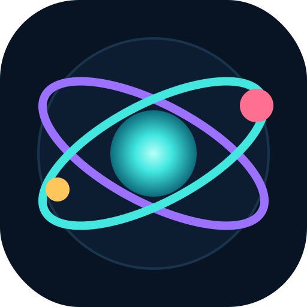
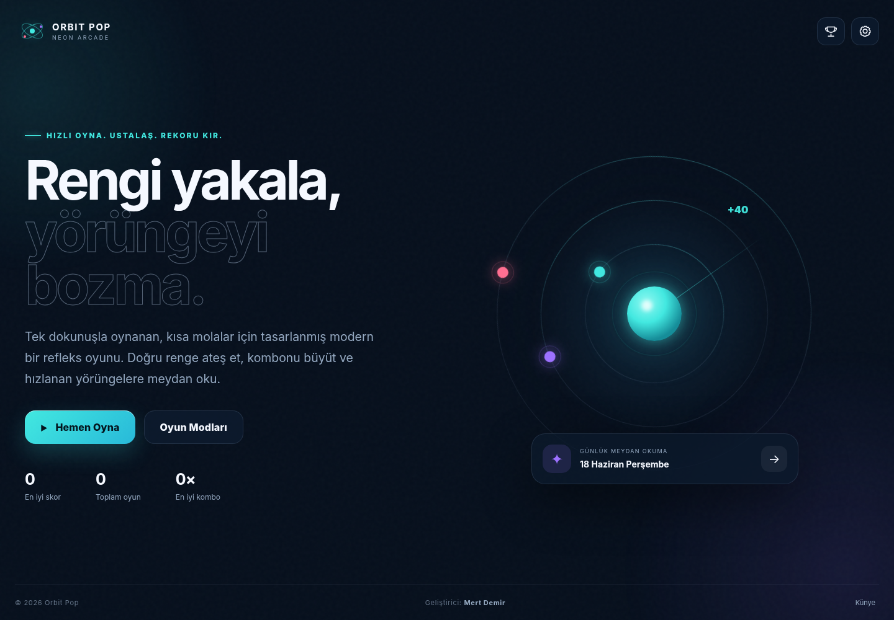
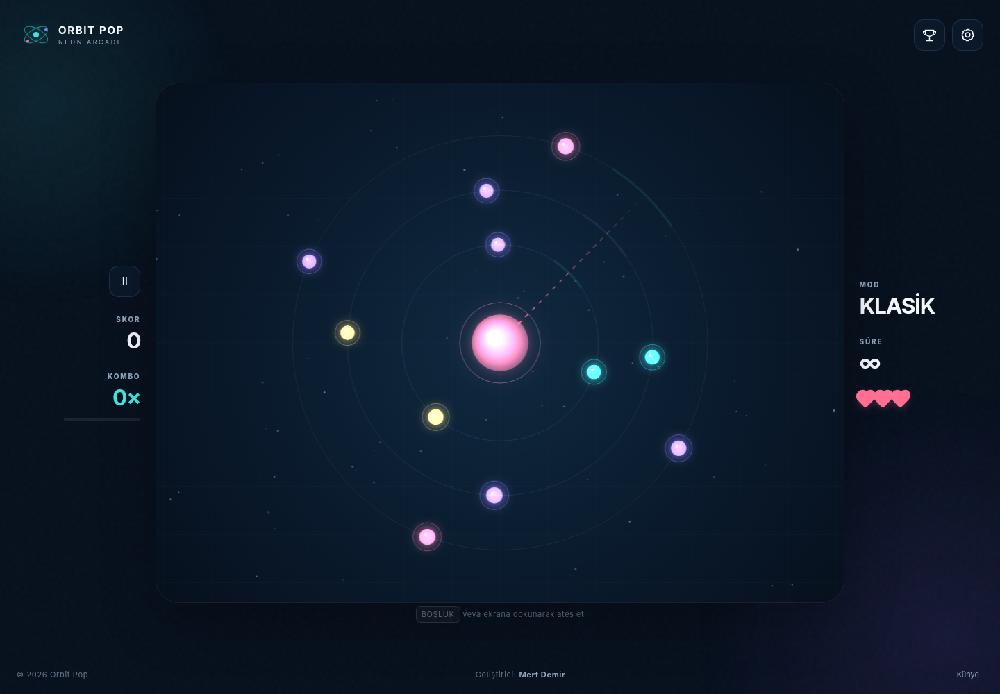
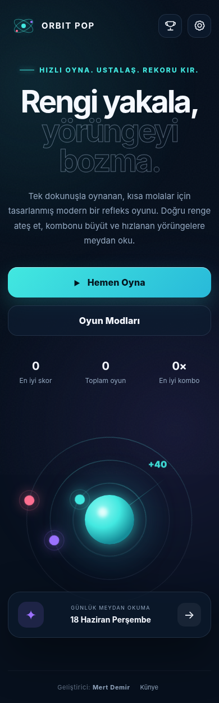
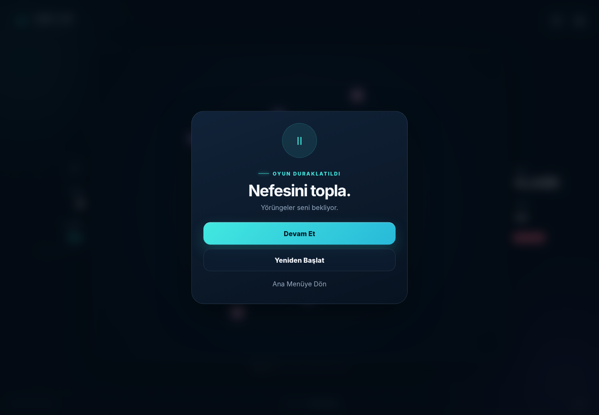
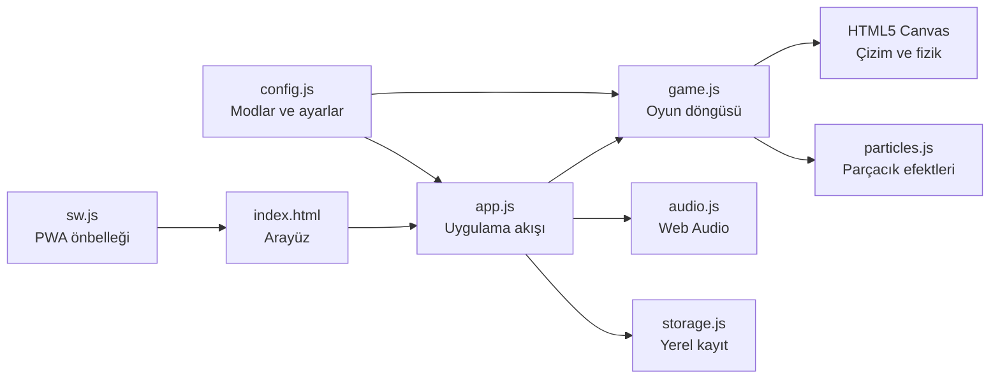

<div align="center">



# ORBIT POP

### Rengi yakala. Yörüngeyi bozma.

Kısa molalar için tasarlanmış, tek dokunuşla oynanan modern bir neon arcade oyunu.

<p>
  
  
  
  
</p>



**HTML5 Canvas · Modern JavaScript · Responsive CSS · PWA · Sıfır harici bağımlılık**

</div>

---

## Oyun hakkında

**Orbit Pop**, merkezdeki çekirdeğin rengiyle eşleşen yörünge hedefini doğru anda vurduğun hızlı bir refleks oyunudur. Başarılı atışlar komboyu yükseltir; yanlış renk veya boşa atış ise oyun moduna göre can kaybettirir.

Oyun; masaüstü, tablet ve mobil tarayıcılarda çalışır. Kurulum gerektirmeden oynanabilir, PWA desteği sayesinde cihaz ana ekranına eklenebilir ve önbelleğe alındıktan sonra çevrimdışı açılabilir.

## Ekran görüntüleri

<table>
  <tr>
    <td width="68%" align="center">
      <br>
      <strong>Gerçek zamanlı oyun alanı</strong>
    </td>
    <td width="32%" align="center">
      <br>
      <strong>Responsive mobil arayüz</strong>
    </td>
  </tr>
</table>

<details>
<summary><strong>Duraklatma ekranını göster</strong></summary>
<br>

</details>

## Öne çıkan özellikler

| Özellik | Açıklama |
|---|---|
| 🎮 Dört oyun modu | Klasik, 60 Saniye, Günlük Görev ve Zen |
| ⚡ Tek dokunuş oynanış | Fare, klavye ve dokunmatik ekran desteği |
| 🔥 Kombo sistemi | Arka arkaya doğru atışlarla yükselen puan ritmi |
| 💎 Beş güçlendirme | Kalkan, çift puan, yavaşlatma, renk dalgası ve mıknatıs |
| 🏆 İlerleme | Yerel skor tablosu, rekorlar ve başarımlar |
| ♿ Erişilebilirlik | Renk körlüğü paleti ve azaltılmış hareket seçeneği |
| 📱 Responsive tasarım | Masaüstü, tablet ve mobil ekranlara uyum |
| 🌐 PWA | Cihaza yükleme ve çevrimdışı çalışma desteği |
| 🔒 Gizlilik | Reklam, analiz veya takip kodu içermez |
| 🧩 Bağımsız yapı | Harici oyun motoru veya çalışma zamanı bağımlılığı yok |

## Oyun modları

| Mod | Amaç | Kurallar |
|---|---|---|
| **Klasik** | Mümkün olan en yüksek skora ulaş | 3 can, artan hız ve dinamik zorluk |
| **60 Saniye** | Bir dakika içinde maksimum puan kazan | Süre baskısı ve hızlı skor akışı |
| **Günlük Görev** | Her gün aynı düzen üzerinde yarış | Tarihe bağlı tekrar üretilebilir meydan okuma |
| **Zen** | Baskısız ve rahat bir oyun deneyimi yaşa | Can veya süre baskısı olmadan serbest oyun |

## Hızlı başlangıç

### Windows — önerilen yöntem

ZIP dosyasını çıkart ve aşağıdaki dosyaya çift tıkla:

```text
BASLAT.bat
```

Başlatıcı uygun çalışma ortamını algılar ve oyunu otomatik olarak tarayıcıda açar.

### PowerShell

```powershell
./BASLAT.ps1
```

### Node.js

```bash
npm start
```

Ardından tarayıcıdan şu adresi aç:

```text
http://localhost:4173
```

### Python

```bash
python -m http.server 4173
```

> `index.html` doğrudan açılabilir. Ancak PWA, servis çalışanı ve çevrimdışı önbellek özellikleri için yerel bir HTTP sunucusu kullanılmalıdır.

## Kontroller

| İşlem | Masaüstü | Mobil |
|---|---|---|
| Ateş et | `Boşluk`, `Enter` veya oyun alanına tıkla | Oyun alanına dokun |
| Duraklat | `P`, `Escape` veya duraklatma düğmesi | Duraklatma düğmesi |
| Seçim | Fare veya klavye | Dokunmatik ekran |

### Nasıl oynanır?

1. Merkezdeki çekirdeğin rengini kontrol et.
2. Aynı renkteki hedefin nişan çizgisine gelmesini bekle.
3. Doğru anda ateş et.
4. Hatasız vuruşlarla kombonu ve puan çarpanını büyüt.
5. Hızlanan ve yön değiştiren yörüngelere uyum sağla.

## Teknik mimari



### Teknolojiler

- Semantik HTML5
- CSS değişkenleri, Grid ve Flexbox
- Modern ES Module JavaScript
- HTML5 Canvas 2D
- Web Audio API
- LocalStorage
- Service Worker ve Web App Manifest
- Node.js tabanlı hafif geliştirme sunucusu

## Proje yapısı

```text
orbit-pop/
├── index.html                  # Ana uygulama arayüzü
├── styles.css                 # Tasarım ve responsive düzen
├── manifest.webmanifest       # PWA tanımı
├── sw.js                      # Çevrimdışı önbellek
├── server.mjs                 # Yerel geliştirme sunucusu
├── package.json               # Komutlar ve proje bilgileri
├── BASLAT.bat                 # Windows hızlı başlatıcı
├── BASLAT.ps1                 # PowerShell başlatıcısı
├── LICENSE                    # MIT lisansı
├── CHECKSUMS.sha256           # Dosya bütünlük değerleri
├── assets/
│   ├── icon.svg
│   ├── icon-192.png
│   ├── icon-512.png
│   └── readme/                # README ekran görüntüleri ve rozetler
├── js/
│   ├── app.js                 # Sayfa ve oyun akışı
│   ├── audio.js               # Ses sistemi
│   ├── config.js              # Modlar, renkler ve başarımlar
│   ├── game.js                # Ana oyun motoru
│   ├── particles.js           # Görsel efektler
│   └── storage.js             # Profil ve skor kayıtları
├── docs/
│   ├── GAME_DESIGN.md         # Oyun tasarım belgesi
│   ├── MARKETING_PLAN.md      # Tanıtım ve büyüme planı
│   └── ROADMAP.md             # Geliştirme yol haritası
└── tests/
    ├── smoke.mjs              # Dosya ve yapı kontrolleri
    └── game-smoke.mjs         # Oyun motoru temel testi
```

## Yapılandırma ve geliştirme

Oyunun temel dengesi `js/config.js` dosyasından değiştirilebilir:

- Oyun modu süreleri
- Başlangıç ve maksimum hız
- Renk paletleri
- Güçlendirme türleri
- Başarımlar
- Varsayılan kullanıcı ayarları

Ana oyun döngüsü ve Canvas çizimleri `js/game.js` içindedir. Menü, modal, dil, skor ve sonuç akışı `js/app.js` üzerinden yönetilir.

Yerel profil verileri aşağıdaki anahtarda saklanır:

```text
orbit-pop-profile-v1
```

Global liderlik tablosu eklemek için oyun sonu akışına bir REST API veya gerçek zamanlı servis bağlanabilir.

## Kod kontrolü

```bash
npm run check
```

Bu komut:

- JavaScript sözdizimini doğrular.
- Gerekli proje dosyalarını kontrol eder.
- Oyun motorunun temel başlangıç davranışını test eder.

## Yayınlama

Proje tamamen statik olarak yayınlanabilir:

- GitHub Pages
- Cloudflare Pages
- Netlify
- Vercel
- Nginx veya Apache
- Standart bir kurumsal web sunucusu

Yayınlama sırasında proje klasörü doğrudan site kökü olarak seçilebilir. PWA özelliklerinin çalışması için HTTPS önerilir.

## Proje belgeleri

- [Oyun Tasarım Belgesi](docs/GAME_DESIGN.md)
- [Pazarlama Planı](docs/MARKETING_PLAN.md)
- [Geliştirme Yol Haritası](docs/ROADMAP.md)

## Geliştirici

<div align="center">

### Mert Demir

**Tasarım · Yazılım · Oyun geliştirme**

Orbit Pop’un oyun fikri, kullanıcı deneyimi, arayüzü ve geliştirme süreci Mert Demir adına hazırlanmıştır.

</div>

## Lisans

Bu proje [MIT Lisansı](LICENSE) ile sunulmaktadır. Lisans koşullarına uygun şekilde kullanılabilir, değiştirilebilir ve dağıtılabilir.

---

<div align="center">

**ORBIT POP** · Neon Arcade · Sürüm 1.0.0

Geliştirici: **Mert Demir**

</div>
